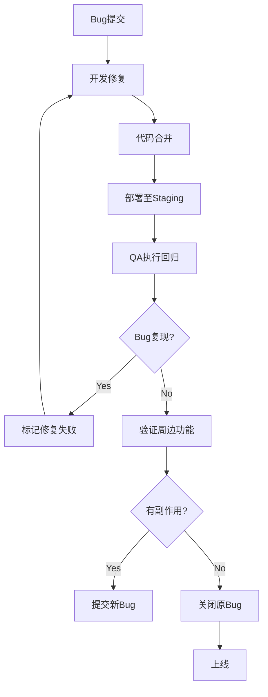

# 海蓝 (HaiLan) Pro - 回归测试规范

> **Bug修复与版本发布后的质量守护网**
> **关联脚本**: `scripts/qa/regressionTestPlan.md` (已整合)

---

## 1. 定义与目的

**回归测试** 是指在软件环境发生变化（如修复Bug、添加新功能、代码重构、环境升级）后，重新执行测试以验证**原有功能未受损**的过程。

**核心目的**:
1.  **防止副作用**: 验证修改 A 是否破坏了 B。
2.  **确保修复**: 验证 Bug 确实被修复，且未引入新问题。
3.  **保障稳定性**: 在每次版本迭代中维持系统质量基线。

---

## 2. 回归触发时机

| 场景 | 触发条件 | 执行范围 | 负责人 |
|------|----------|---------|--------|
| **Bug修复回归** | P0/P1 Bug 修复并部署至 Staging | 仅针对 Bug 影响的模块及周边功能 | QA Team |
| **版本回归** | 新版本合并至主分支后，发布前 | 全量核心流程 (P0/P1 用例) | QA Team |
| **紧急热修回归** | 线上紧急问题修复后 | 仅热修点 + 关联支付/订单流程 | DevOps + QA |
| **代码重构回归** | 大规模重构或库升级后 | 受影响模块全量回归 | Dev + QA |

---

## 3. 测试范围策略

### 3.1 风险导向回归
- **优先级 1 (P0)**: 购物车、结算、支付、订单（任何改动必测）。
- **优先级 2 (P1)**: 用户登录、商品详情、搜索（改动相关则测）。
- **优先级 3 (P2)**: 静态页面、非核心交互（自动化覆盖即可，偶尔手工）。

### 3.2 冲击域
对于每次修改，分析其**冲击域**，确定测试范围：
- **前端修改**: 检查受影响的组件及父级路由。
- **API 修改**: 检查调用该 API 的所有页面及错误处理。
- **数据库修改**: 检查涉及该表的查询、写入逻辑。

---

## 4. 回归测试用例集

回归测试并非每次都执行全量用例，而是使用**分层回归集**：

| 用例集 | 包含内容 | 执行频率 | 自动化程度 |
|------|---------|---------|----------|
| **核心回归集** | 登录、加购、结算、支付、订单 | 每次提交/部署 | 100% 自动化 |
| **全功能回归集** | 所有 P0/P1 功能点，UAT 清单 | 每周/大版本前 | 80% 自动化 (20% E2E) |
| **专项回归集** | 性能、兼容性、安全 | 每月/大版本前 | 工具辅助 |

**核心回归集示例 (必须100%自动化)**:
1. 用户登录/退出。
2. 浏览商品列表。
3. 进入商品详情。
4. 添加商品到购物车。
5. 购物车修改数量。
6. 结算页填写地址。
7. 选择支付方式并支付。
8. 验证订单生成。

---

## 5. 执行流程

### 5.1 Bug修复回归流程


### 5.2 版本回归流程
1. **代码合并**: 开发分支合并至 `main`。
2. **CI 触发**: 自动运行单元测试，失败则阻断。
3. **自动回归**: CI 运行核心回归集。
4. **手工验证**: QA 在 Staging 验证全功能集。
5. **Bug录入**: 发现问题录入 Jira，修复后回归。

---

## 6. 自动化回归策略

为了加快回归速度，必须最大化自动化比例：

### 6.1 增量回归 (Delta)
- 对于大项目，仅运行与本次修改代码相关的测试用例。
- 利用代码覆盖率工具 (Istanbul/NYC) 找到受影响的测试文件，仅执行这些文件。
- **收益**: 将全量回归时间从 2小时缩短至 10分钟。

### 6.2 并行执行
- 使用 CI/CD (GitHub Actions) 的矩阵策略，并行运行 E2E 测试。
- 浏览器并行：Chrome, Firefox, Edge 同时运行。
- 测试用例并行：将测试文件分片执行。

### 6.3 快速反馈循环
- **Smoke Tests**: 最精简的回归集（<5分钟），部署后立刻跑，确保系统存活。
- **Core Regression**: 完整的核心集（<30分钟），Smoke 通过后执行。

---

## 7. 回归测试报告

每次回归测试后，需输出《回归测试报告》，包含以下字段：

| 字段 | 说明 |
|------|------|
| **回归ID** | RT-YYYYMMDD-001 |
| **回归类型** | Bug修复 / 版本发布 / 重构 |
| **执行范围** | 核心集 / 全功能集 / 专项集 |
| **执行用例数** | 总计 / 通过 / 失败 / 阻塞 |
| **通过率** | (通过数 / 总数) * 100% |
| **缺陷列表** | 新发现的 Bug ID 及简述 |
| **风险评估** | 基于缺陷评估上线风险 (高/中/低) |
| **结论** | 建议：上线 / 回退 / 修复后上线 |

**模版示例**:
```markdown
# 回归测试报告 (RT-20260204-01)
- **日期**: 2026-02-04
- **类型**: Bug修复回归 (Fix #123)
- **结果**: 通过 (98%)
- **未通过用例**: UAT-015 (支付超时)
- **风险**: 低 (UI错乱，不影响支付)
- **建议**: 上线，UI问题挂起下一版修复。
```

---

## 8. 常见误区与最佳实践

### 误区
1.  **只测Bug点**: 以为修复Bug只要验证该点即可，忽略了关联功能。
2.  **忽略配置变更**: 环境变量、Nginx配置修改后未做回归。
3.  **依赖手工**: 每次回归都纯手工执行，效率低且易遗漏。

### 最佳实践
1.  **自动化优先**: 核心回归集必须 100% 自动化。
2.  **数据隔离**: 回归测试数据必须清理重置，避免脏数据干扰。
3.  **快速反馈**: 利用并行和增量策略，将回归时间压缩至 30分钟内。
4.  **留痕**: 无论成功失败，都应截图、录屏（E2E），便于事后分析。

---

## 9. 工具支持

| 工具 | 用途 | 链接 |
|------|------|------|
| **Jira / Notion** | Bug 跟踪，关联回归版本。 | [项目管理工具](../..) |
| **GitHub Actions** | 自动化触发回归测试。 | [CI/CD配置](../HaiLan-Pro-测试体系/03-持续集成与测试.md) |
| **Cypress Dashboard** | 查看 E2E 回归结果视频和截图。 | [自动化框架](../HaiLan-Pro-测试体系/02-自动化测试框架.md) |
| **Lighthouse CI** | 性能回归对比。 | [性能策略](../HaiLan-Pro-测试体系/01-测试策略概述.md) |
