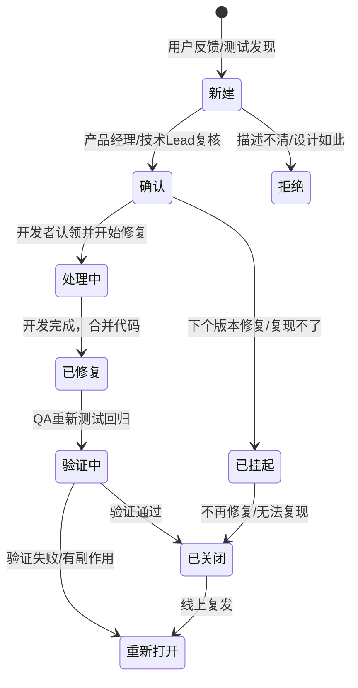

# 海蓝 (HaiLan) Pro - Bug 生命周期管理

> **缺陷追踪与质量闭环的核心流程**

---

## 1. 定义

**Bug (缺陷)**: 指软件中存在的任何错误、瑕疵、故障、或未达到预期功能的情况，阻碍了用户使用或系统运行。

**生命周期**: 从 Bug 被发现、录入、修复、验证到最终关闭的全过程。

---

## 2. Bug 分级标准

为了合理分配资源，所有 Bug 必须根据严重程度分级：

| 级别 | 定义 | 业务影响 | 示例 | 响应时间 (SLA) | 上线标准 |
|------|------|---------|------|-------------|---------|
| **P0 (Critical)** | 系统崩溃、核心流程阻断、数据丢失、资损 | 无法下单、支付失败、数据库连接失败 | 4小时 | 必须修复 |
| **P1 (High)** | 核心功能不可用、严重性能问题 | 无法登录、商品无法加载、订单无法查看 | 24小时 | 必须修复 |
| **P2 (Medium)** | 部分功能异常、UI错乱但不影响核心流程 | 按钮样式错位、非核心页404、图片未加载 | 3天 | 视情况修复或挂起 |
| **P3 (Low)** | 文案错误、微小体验优化、建议 | 错别字、提示信息不够友好、配色微调 | 1周 | 可延后版本修复 |

---

## 3. Bug 状态流转

标准 Bug 生命周期包含以下状态流转：



**状态说明**:
1.  **新建**: Bug 刚提交，待确认。
2.  **确认**: PM/Lead 确认该 Bug 有效，分配优先级。
3.  **拒绝**: 描述错误、重复提交、或设计如此，关闭 Bug。
4.  **处理中**: 开发者正在修复。
5.  **已挂起**: 当前版本不修，延后或待进一步信息。
6.  **已修复**: 开发完成，等待 QA 验证。
7.  **验证中**: QA 正在执行回归测试。
8.  **已关闭**: Bug 修复验证成功。
9.  **重新打开**: 修复验证失败，或 Bug 复发。

---

## 4. 流程详解

### 4.1 发现与录入 (New)
- **发现者**: QA测试、用户反馈、线上监控报警 (Sentry)。
- **录入工具**: Jira / Notion。
- **必填项**:
    - 标题: 简洁明了，如“[P0] 支付回调未执行”。
    - 优先级: P0-P3。
    - 描述: 复现步骤、预期结果、实际结果。
    - 环境: 版本号、浏览器型号、URL。
    - 证据: 截图、录屏、日志片段。

### 4.2 复核与分配
- **责任人**: Tech Lead 或 PM。
- **动作**:
    - 确认 Bug 是否为重复提交。
    - 确认优先级是否合理。
    - 分配给具体开发者。

### 4.3 修复 (In Progress)
- **责任人**: 开发者。
- **动作**:
    - 定位代码问题。
    - 编写修复代码。
    - 添加/更新自动化测试用例（防止复发）。
    - 合并代码至开发分支。

### 4.4 验证 (Verification)
- **责任人**: QA 团队。
- **动作**:
    - 拉取最新代码，部署至 Staging。
    - 按照“回归测试规范”执行测试。
    - **回归范围**: Bug 本身 + 关联模块。
- **结果**:
    - **验证通过**: 关闭 Bug。
    - **验证失败**: 重新打开 Bug，指明原因（未修复/有副作用/引入新Bug）。

### 4.5 上线检查
- **条件**: P0/P1 Bug 必须 **全部关闭**，或经 PM/Lead 风险评估后**有条件上线**。
- **确认**: 在“上线决策会”上检查 Bug Board，确认无阻断性问题。

---

## 5. 回归与副作用

在修复 Bug 时，经常容易引入**副作用**（修好了A，把B弄坏了）。

**防范措施**:
1.  **自动化覆盖**: 修复的 Bug 对应测试用例必须加入 CI/CD。
2.  **模块回归**: 修复支付 Bug，必须测试订单、物流模块。
3.  **回归测试**: 详见 [`02-回归测试规范.md`](./02-回归测试规范.md)。

---

## 6. Bug 报告模版

请使用以下模版提交 Bug，以提高修复效率：

```markdown
### Bug 标题
[优先级] 简短描述问题

### 环境信息
- **平台**: iOS/Android/Web/Windows/Mac
- **版本**: v1.2.3 (Build 20260204)
- **浏览器/系统**: Chrome v120 / iOS 17

### 复现步骤
1. 打开首页
2. 点击“登录”按钮
3. 输入用户名 `admin` 和密码 `123456`
4. 点击“登录”

### 预期结果
登录成功，跳转至个人中心。

### 实际结果
登录失败，提示“系统繁忙”，控制台报错 `500 Internal Server Error`。

### 截图/录屏
[上传截图或视频链接]

### 附加信息
- **发生频率**: 100% (必现) / 30% (偶现)
- **日志片段**: 
  ```
  [ERROR] 2026-02-04 10:00:00 User authentication failed: DB connection timeout.
  ```
```

---

## 7. 指标与分析

每双周对 Bug 生命周期的数据进行统计分析，持续改进：

| 指标 | 公式 | 健康度 |
|------|------|--------|
| **Bug 修复时长** | Σ(关闭时间 - 创建时间) / 总Bug数 | 越短越好 |
| **Bug 回归率** | (重开的Bug数 / 已关闭的Bug数) * 100% | 越低越好 (<10%) |
| **遗留 Bug 数** | 版本发布时未关闭的 P0/P1 Bug数 | 必须为 0 |
| **漏测率** | (上线后发现的Bug数 / 全部Bug数) * 100% | 越低越好 |

---

## 8. 工具配置

| 工具 | 用途 | 配置链接 |
|------|------|---------|
| **Jira** | Bug 追踪 | [项目看板](https://jira.hailan.com) |
| **Sentry** | 线上错误自动报 Bug | [Sentry Dashboard](https://sentry.hailan.com) |
| **SonarQube** | 代码质量，提前发现 Bug | [SonarQube](http://sonar.hailan.com) |
| **GitHub** | 代码 Review (Review) | [Pull Request Workflow](../../..) |
