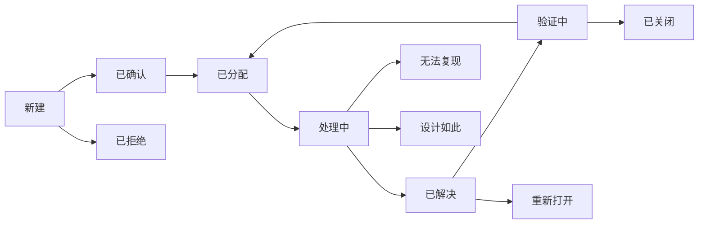

> ***YanYuCloudCube***
> **标语**：言启象限 | 语枢未来
> ***Words Initiate Quadrants, Language Serves as Core for the Future***
> **标语**：万象归元于云枢 | 深栈智启新纪元
> ***All things converge in the cloud pivot; Deep stacks ignite a new era of intelligence***

---

# 136 缺陷管理流程

## 概述

本文档详细描述HaiLan Pro-HaiLan-Pro-审核测试-缺陷管理流程相关内容，确保项目按照YYC³标准规范进行开发和实施。

## 核心内容

### 1. 背景与目标

#### 1.1 项目背景
HaiLan Pro (海蓝) 是新一代高端、私密、智能的情趣健康生活管理平台。项目基于「五高五标五化」理念，通过 PWA 技术结合 AI 智能辅助与物联网，为用户提供从生理健康到心理愉悦的全方位解决方案。

#### 1.2 项目愿景
打造极致隐私、智能陪伴、品质合规、全场景覆盖的情趣健康生活管理平台，为用户提供安全、专业、高端的健康生活体验。

#### 1.3 核心价值主张
- **极致隐私**：双重加密、隐私浏览模式及伪装发货机制
- **智能陪伴**：基于 LLM 的 AI 情感与生理健康顾问
- **品质合规**：医疗级标准商品，高端"海蓝蓝"视觉调性
- **全场景覆盖**：PWA 端支持离线浏览、桌面安装及无缝推送

#### 1.4 文档目标
- 规范缺陷管理流程相关的业务标准与技术落地要求
- 为项目相关人员提供清晰的参考依据
- 保障相关模块开发、实施、运维的一致性与规范性

### 2. 设计原则

#### 2.1 五高原则
- **高可用性**：确保系统7x24小时稳定运行，支持PWA离线能力
- **高性能**：优化响应时间和处理能力，支持高并发访问
- **高安全性**：保护用户数据和隐私安全，双重加密机制
- **高扩展性**：支持业务快速扩展，微服务架构设计
- **高可维护性**：便于后续维护和升级，模块化设计

#### 2.2 五标体系
- **标准化**：统一的技术和流程标准
- **规范化**：严格的开发和管理规范
- **自动化**：提高开发效率和质量，CI/CD自动化
- **智能化**：利用AI技术提升能力，LLM智能顾问
- **可视化**：直观的监控和管理界面

#### 2.3 五化架构
- **流程化**：标准化的开发流程
- **文档化**：完善的文档体系
- **工具化**：高效的开发工具链
- **数字化**：数据驱动的决策
- **生态化**：开放的生态系统

### 3. 缺陷管理流程

#### 3.1 缺陷生命周期



```yaml
缺陷状态定义:

  新建(New):
    触发条件: 测试人员发现缺陷并提交
    负责人: 测试组长
    操作: 审核缺陷有效性

  已确认(Confirmed):
    触发条件: 缺陷被确认有效
    负责人: 测试组长
    操作: 分配给开发人员

  已拒绝(Rejected):
    触发条件: 缺陷无效/重复/不是问题
    负责人: 测试组长
    操作: 关闭缺陷

  已分配(Assigned):
    触发条件: 缺陷分配给开发人员
    负责人: 开发人员
    操作: 开始修复

  处理中(In Progress):
    触发条件: 开发人员开始修复
    负责人: 开发人员
    操作: 修复缺陷

  已解决(Resolved):
    触发条件: 开发人员完成修复
    负责人: 测试人员
    操作: 验证修复

  无法复现(Cannot Reproduce):
    触发条件: 开发人员无法复现
    负责人: 测试人员
    操作: 提供更多信息

  设计如此(Works as Designed):
    触发条件: 不是缺陷，是预期行为
    负责人: 产品经理
    操作: 确认或转为需求

  验证中(Verifying):
    触发条件: 测试人员验证修复
    负责人: 测试人员
    操作: 确认修复或重新打开

  已关闭(Closed):
    触发条件: 修复验证通过
    负责人: 测试人员
    操作: 归档

  重新打开(Reopened):
    触发条件: 验证失败，缺陷仍然存在
    负责人: 开发人员
    操作: 继续修复
```

#### 3.2 缺陷严重级别

```yaml
缺陷严重级别定义:

  致命(Critical) - P0:
    定义: 系统崩溃、数据丢失、安全漏洞
    影响: 用户无法使用核心功能
    修复时间: 24小时内
    示例:
      - 系统崩溃无法启动
      - 数据库连接失败
      - 用户数据泄露
      - 支付异常(扣款但订单未创建)
      - 隐私数据明文存储

  严重(Major) - P1:
    定义: 主要功能不可用
    影响: 用户无法完成主要操作
    修复时间: 48小时内
    示例:
      - 登录功能异常
      - 购物车无法添加商品
      - 支付失败
      - 隐私模式切换失败
      - AI服务无响应

  一般(Minor) - P2:
    定义: 功能可用但有缺陷
    影响: 影响用户体验但不影响主要流程
    修复时间: 1周内
    示例:
      - UI显示错误
      - 按钮点击无反应
      - 数据加载缓慢
      - 错误提示不准确
      - 隐私信息未完全脱敏

  轻微(Trivial) - P3:
    定义: 小问题，影响范围小
    影响: 不影响功能使用
    修复时间: 下个版本
    示例:
      - 文字错误
      - 图标显示不正确
      - 样式微调
      - 提示文案优化

  建议(Suggestion):
    定义: 改进建议
    影响: 不是缺陷，是优化方向
    处理: 评估后决定是否采纳
    示例:
      - 功能改进建议
      - 体验优化建议
      - 性能优化建议
```

#### 3.3 缺陷报告模板

```markdown
## 缺陷报告

**缺陷ID**: BUG-{PROJECT}-{NUMBER}
**缺陷标题**: [严重级别] 简短描述缺陷

### 基本信息
| 字段 | 内容 |
|------|------|
| 提交人 | 姓名 |
| 提交时间 | YYYY-MM-DD HH:mm:ss |
| 严重级别 | 致命/严重/一般/轻微 |
| 优先级 | P0/P1/P2/P3 |
| 状态 | 新建 |
| 指派给 | 开发人员 |
| 影响版本 | v1.0.0 |
| 修复版本 | v1.0.1 |
| 关联需求 | REQ-XXX |
| 关联测试用例 | TC-XXX |

### 环境信息
| 项目 | 内容 |
|------|------|
| 测试环境 | 测试/预发布/生产 |
| 操作系统 | iOS 15 / Android 12 |
| 浏览器 | Chrome 100 / Safari 15 |
| 设备 | iPhone 13 / Pixel 6 |
| 网络环境 | WiFi / 4G / 5G |

### 缺陷描述
详细描述缺陷现象

### 复现步骤
1. 步骤1
2. 步骤2
3. 步骤3

### 实际结果
描述实际发生的情况

### 预期结果
描述应该发生的情况

### 附件
- 截图: [上传截图]
- 录屏: [上传录屏]
- 日志: [粘贴日志]

### 备注
其他补充说明
```

#### 3.4 缺陷报告示例

```markdown
## BUG-HL-001 隐私等级切换后敏感信息未脱敏

**缺陷标题**: [严重] 隐私等级切换后敏感信息未脱敏

### 基本信息
| 字段 | 内容 |
|------|------|
| 提交人 | 张三 |
| 提交时间 | 2026-01-26 14:30:00 |
| 严重级别 | 严重 |
| 优先级 | P1 |
| 状态 | 新建 |
| 指派给 | 李四(后端开发) |
| 影响版本 | v1.0.0 |
| 修复版本 | v1.0.1 |
| 关联需求 | REQ-PRIV-005 |
| 关联测试用例 | TC-PRIV-002 |

### 环境信息
| 项目 | 内容 |
|------|------|
| 测试环境 | 测试环境 |
| 操作系统 | iOS 15.2 |
| 浏览器 | Safari 15.2 |
| 设备 | iPhone 13 |
| 网络环境 | WiFi |

### 缺陷描述
当用户将隐私等级从标准模式切换到隐身模式后，个人中心的邮箱和手机号仍然显示完整信息，未进行脱敏处理。这可能导致用户隐私信息泄露。

### 复现步骤
1. 登录账号 test@hailan.pro
2. 进入"设置" -> "隐私设置"
3. 点击"隐身模式"并确认切换
4. 返回"个人中心"页面
5. 查看"邮箱"和"手机号"字段

### 实际结果
邮箱显示: test@hailan.pro
手机号显示: 13800138000

### 预期结果
邮箱应显示: ***@hailan.pro
手机号应显示: 138****8000

### 根因分析
初步判断是前端脱敏逻辑未正确触发，可能是隐私等级状态更新后未通知相关组件重新渲染。

### 附件
- 截图:


- 日志:
```
[14:30:15] INFO: Privacy level changed from STANDARD to STEALTH
[14:30:15] INFO: State updated, userId: test@hailan.pro
[14:30:16] WARN: Component UserProfile did not re-render
```

### 备注
此问题影响所有隐身模式用户，属于高优先级问题。
```

#### 3.5 缺陷统计分析

```yaml
缺陷统计指标:

  数量统计:
    - 新增缺陷数: 按周期统计
    - 已解决缺陷数: 按周期统计
    - 遗留缺陷数: 当前未关闭
    - 缺陷总数: 累计总数

  质量指标:
    - 缺陷密度: 缺陷数/代码行数
    - 缺陷修复率: 已解决/总数
    - 缺陷 reopen率: 重新打开/已解决
    - 平均修复时长: 总修复时长/缺陷数

  趋势分析:
    - 缺陷发现趋势: 按时间统计
    - 缺陷修复趋势: 按时间统计
    - 缺陷积压趋势: 遗留缺陷变化

  分布分析:
    - 按严重级别分布
    - 按功能模块分布
    - 按责任人分布
    - 按引入原因分布
```

#### 3.6 缺陷评审会议

```yaml
缺陷评审流程:

  会议目的:
    - 确认缺陷有效性
    - 确定缺陷优先级
    - 分配缺陷修复责任人
    - 评估修复工作量
    - 确定修复版本

  参会人员:
    - 测试负责人(主持)
    - 开发负责人
    - 产品负责人
    - 相关开发人员

  会议议程:
    1. 审阅新增缺陷(5分钟/个)
       - 确认是否为缺陷
       - 确定严重级别和优先级
       - 评估修复工作量
       - 分配责任人

    2. 审阅已解决缺陷(3分钟/个)
       - 修复方案评审
       - 确认是否可以关闭

    3. 审阅长期未解决缺陷
       - 分析阻塞原因
       - 制定解决方案

    4. 遗留缺陷风险评估
       - 评估发布风险
       - 制定缓解措施

  会议输出:
    - 缺陷评审记录
    - 缺陷分配结果
    - 修复版本计划
    - 风险评估报告
```

#### 3.7 缺陷预防措施

```yaml
缺陷预防措施:

  需求阶段:
    - 需求评审充分
    - 需求明确清晰
    - 考虑边界条件
    - 考虑异常场景

  设计阶段:
    - 设计评审
    - 架构评审
    - 接口设计规范
    - 考虑扩展性

  编码阶段:
    - 遵循编码规范
    - 代码审查
    - 单元测试覆盖
    - 使用安全编码实践

  测试阶段:
    - 测试用例完整
    - 测试环境稳定
    - 自动化测试覆盖
    - 回归测试充分

  发布阶段:
    - 预发布验证
    - 灰度发布
    - 监控告警
    - 回滚预案
```

#### 3.8 缺陷管理工具配置

```typescript
// defect-management/config.ts
export const defectConfig = {
  // 缺陷编号规则
  idPattern: 'BUG-{PROJECT}-{NUMBER}',

  // 项目代码
  projects: {
    HL: 'HaiLan-Pro',
    HL_API: 'HaiLan-Pro-API',
    HL_WEB: 'HaiLan-Pro-Web',
  },

  // 严重级别
  severities: {
    CRITICAL: { value: 1, name: '致命', color: 'red', fixTime: 24 },
    MAJOR: { value: 2, name: '严重', color: 'orange', fixTime: 48 },
    MINOR: { value: 3, name: '一般', color: 'yellow', fixTime: 168 },
    TRIVIAL: { value: 4, name: '轻微', color: 'blue', fixTime: null },
    SUGGESTION: { value: 5, name: '建议', color: 'gray', fixTime: null },
  },

  // 优先级
  priorities: {
    P0: { name: 'P0-立即', description: '影响发布' },
    P1: { name: 'P1-紧急', description: '24小时内' },
    P2: { name: 'P2-高', description: '48小时内' },
    P3: { name: 'P3-中', description: '1周内' },
    P4: { name: 'P4-低', description: '下个版本' },
  },

  // 缺陷状态流转规则
  stateTransitions: {
    NEW: ['CONFIRMED', 'REJECTED'],
    CONFIRMED: ['ASSIGNED'],
    ASSIGNED: ['IN_PROGRESS', 'REJECTED'],
    IN_PROGRESS: ['RESOLVED', 'CANNOT_REPRODUCE', 'WORKS_AS_DESIGNED'],
    RESOLVED: ['VERIFIED', 'REOPENED', 'CLOSED'],
    VERIFIED: ['CLOSED', 'REOPENED'],
    REOPENED: ['ASSIGNED'],
    CANNOT_REPRODUCE: ['ASSIGNED', 'CLOSED'],
    WORKS_AS_DESIGNED: ['CLOSED'],
    REJECTED: ['CLOSED'],
  },

  // 通知规则
  notifications: {
    BUG_CREATED: ['assignee', 'teamLead'],
    BUG_ASSIGNED: ['assignee'],
    BUG_RESOLVED: ['reporter', 'qaLead'],
    BUG_REOPENED: ['assignee', 'reporter', 'teamLead'],
    BUG_CRITICAL: ['all'], // 致命缺陷全员通知
  },
};
```

---

> 「***YanYuCloudCube***」
> 「***<admin@0379.email>***」
> 「***Words Initiate Quadrants, Language Serves as Core for the Future***」
> 「***All things converge in the cloud pivot; Deep stacks ignite a new era of intelligence***」
