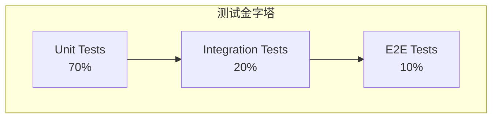

# 海蓝 (HaiLan) Pro - 测试策略概述

> **测试体系的顶层设计文档**

---

## 1. 核心原则

### 1.1 测试驱动开发 (TDD)

- 鼓励在编写业务代码前先编写单元测试用例。
- 红绿重构循环：失败 (红) -> 通过 (绿) -> 重构。
- **收益**: 代码解耦，模块化更好，重构更安全。

### 1.2 风险导向

- 核心支付、订单、物流路径：E2E + 压力测试全覆盖。
- 非核心展示页面：仅做单元 + 视觉回归。
- **收益**: 资源投入最大化，聚焦高风险点。

### 1.3 持续集成 (CI/CD)

- 测试必须自动化，禁止手工执行作为质量门禁。
- 每次提交触发单元测试。
- 每次合并到主分支触发全量测试。
- **收益**: 问题尽早发现，拒绝“带病上线”。

---

## 2. 测试金字塔

海蓝 Pro 遵循以下金字塔模型：

| 层级 | 覆盖范围 | 工具 | 执行速度 | 数量占比 | 维护成本 |
|------|---------|------|---------|---------|---------|
| **单元测试** | 函数、组件、Hook | Vitest | < 1s | 70% | 低 |
| **集成测试** | API 接口、数据库交互 | Supertest | 1s - 5s | 20% | 中 |
| **E2E 测试** | 用户完整业务流程 | Cypress | 10s - 60s | 10% | 高 |

**策略解读**:

- **底层 (Unit)**: 快速反馈，覆盖所有分支逻辑。
- **中层 (Integration)**: 验证接口契约，确保前后端数据交互正确。
- **顶层 (E2E)**: 验证关键路径（登录 -> 购物 -> 支付），仅覆盖最核心的流程。

---

## 3. 覆盖率标准

### 3.1 代码覆盖率

基于 `Vite v8` 覆盖率提供程序，强制执行：

| 指标 | 目标阈值 | 阻断级别 |
|------|----------|---------|
| **Lines (行覆盖)** | 85% | Warning (但合并建议 >90%) |
| **Functions (函数覆盖)** | 85% | Warning |
| **Branches (分支覆盖)** | 80% | Warning |
| **Statements (语句覆盖)** | 85% | Warning |

**例外情况**:

- `__tests__` 目录下的测试文件本身不统计。
- 类型定义文件 `.d.ts` 不统计。
- 第三方库 (node_modules) 不统计。

### 3.2 功能覆盖率

- **P0 功能 (核心购物流程)**: 100% 覆盖 E2E 用例。
- **P1 功能 (社区、积分)**: 80% 覆盖 E2E 用例，其余由集成测试覆盖。
- **P2 功能 (静态展示)**: 50% 覆盖 E2E，重点通过 UI 自动化测试验证。

---

## 4. 测试分类

### 4.1 按执行时机

| 类型 | 触发条件 | 执行者 | 目的 |
|------|----------|--------|------|
| **冒烟测试** | 部署后 | 自动化 | 快速验证环境可用，主流程通畅。 |
| **回归测试** | Bug修复后 / 每次大版本前 | QA | 确保新代码未破坏旧功能。 |
| **验收测试 (UAT)** | 上线前 | 业务方 | 验证产品是否符合业务需求。 |
| **基准测试** | 代码提交时 | 自动化 | 确保性能未退化。 |

### 4.2 按测试对象

| 对象 | 测试内容 | 工具 |
|------|---------|------|
| **UI 组件** | 渲染正确、交互响应、样式无错乱 | Vitest + React Testing Library |
| **API 接口** | 请求参数、响应数据、状态码、错误处理 | Supertest + Jest |
| **数据库** | 数据一致性、外键约束、索引效率 | SQL 脚本 + Schema Validate |
| **兼容性** | 不同浏览器、不同分辨率显示正常 | Cypress (Sauce Labs/BrowserStack) |
| **安全性** | OWASP Top 10 漏洞扫描 | OWASP ZAP, SonarQube |

---

## 5. 性能测试策略

### 5.1 测试场景

1. **基准测试**: 单用户下的基线性能（首次测试建立）。
2. **负载测试**: 预期峰值流量（如大促）下的表现。
3. **压力测试**: 寻找系统崩溃点和性能拐点（通常为负载的 2-3 倍）。
4. **稳定性测试**: 长时间高负载运行（24h+），检测内存泄露。

### 5.2 性能指标 (SLA)

- **前端**: Lighthouse Score > 90, FCP < 1.8s, LCP < 2.5s。
- **后端**: p95 < 1000ms, p99 < 2000ms。
- **可用性**: 99.9% Uptime (即停机时间 < 43.2分钟/月)。

---

## 6. 安全测试策略

### 6.1 静态分析 (SAST)

- 工具: SonarQube, Snyk。
- 执行时机: 提交代码时。
- 覆盖: 密码硬编码、SQL注入风险、依赖库已知漏洞。

### 6.2 动态分析 (DAST)

- 工具: OWASP ZAP, Burp Suite。
- 执行时机: 部署到 Staging 环境后。
- 覆盖: XSS, CSRF, 会话劫持, 权限绕过。

### 6.3 渗透测试

- **频率**: 每季度一次，或上线前。
- **深度**: 黑盒测试 + 部分灰盒测试（基于API文档）。
- **要求**: 0 High/Critical 漏洞上线。

---

## 7. 缺陷管理

### 7.1 Bug 分级

| 级别 | 定义 | 响应时间 | 上线标准 |
|------|------|----------|---------|
| **P0 (Critical)** | 系统崩溃、数据丢失、支付失败 | 4h 内 | 必须修复 |
| **P1 (High)** | 核心功能不可用、严重性能问题 | 24h 内 | 必须修复 |
| **P2 (Medium)** | 部分功能异常、UI 错乱但不影响核心流程 | 3天内 | 视情况修复或挂起 |
| **P3 (Low)** | 文案错误、样式微调、体验优化 | 1周内 | 可延后版本修复 |

### 7.2 修复验证

- **自动验证**: 单元测试用例必须覆盖该 Bug 场景。
- **手工验证**: QA 需手工重现 Bug 并确认修复。
- **回归验证**: 修复 Bug 后，需执行相邻模块的回归测试。

---

## 8. 数据准备

- **隔离原则**: 测试数据与生产数据严格分离。绝不使用真实用户隐私数据进行测试。
- **Mock 数据**: 使用 Factory 模式生成测试数据，确保数据一致性。
- **种子数据**: 在 Staging 环境预置标准数据（商品、用户），以便复现特定场景。

---

## 9. 持续改进 (闭环)

每双周召开 **QAR (Quality Assurance Review)** 会议：

1. **Review**: 回顾上周漏测的 Bug，分析原因。
2. **Update**: 根据漏测点，增加用例或自动化脚本。
3. **Refine**: 优化测试流程或工具链。

**输入**: Sentry 报错、生产环境反馈、UAT 发现的问题。
**输出**: 更新的测试策略、新增的自动化脚本、优化的覆盖率指标。
