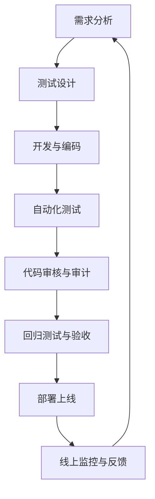

# 海蓝 (HaiLan) Pro - 测试体系闭环 (最终版)

> **项目文档索引**: [返回总览](../005-HaiLan-Pro-项目进度-总览报告.md)

> **核心理念**: **测试不仅是找Bug，更是质量保障体系。**
> **目标**: 构建 "自动化、标准化、闭环化" 的测试生态系统。

---

## 🔄 测试闭环

海蓝 Pro 的测试体系遵循 **PDCA (Plan-Do-Check-Act)** 循环，确保持续改进：

**闭环关键节点**:
1.  **Plan**: 需求评审 -> 测试用例设计 -> 自动化脚本编写。
2.  **Do**: CI/CD 自动执行单元测试、构建、E2E测试。
3.  **Check**: Code Review (SonarQube), 审核测试 (UAT, Regression, Performance, Security)。
4.  **Act**: 上线部署 -> APM监控 -> Bug反馈 -> 下一轮优化。

---

## 📂 目录结构

### 1. 测试体系策略 (`./`)
定义测试的方法论、工具选型和架构标准。

| 文档 | 描述 | 状态 |
|------|------|------|
| [01-测试策略概述.md](./01-测试策略概述.md) | **核心文档**。定义测试金字塔、覆盖率标准、质量门禁。 | ✅ |
| [02-自动化测试框架.md](./02-自动化测试框架.md) | Vitest, Cypress, k6 的配置规范与最佳实践。 | ✅ |
| [03-持续集成与测试.md](./03-持续集成与测试.md) | GitHub Actions 流水线集成，自动阻断标准。 | ✅ |
| [04-测试数据管理.md](./04-测试数据管理.md) | Mock 数据、种子数据、环境隔离策略。 | ✅ |
| [05-测试环境管理.md](./05-测试环境管理.md) | Local, Staging, Production 环境规划。 | ✅ |

### 2. 审核与执行规范 (`../审核测试/`)
定义具体的执行流程、验收标准和审计规范。

| 文档 | 描述 | 状态 |
|------|------|------|
| [01-UAT验收标准.md](../审核测试/01-UAT验收标准.md) | 用户验收测试清单，上线前必须通过的检查项。 | ✅ |
| [02-回归测试规范.md](../审核测试/02-回归测试规范.md) | Bug修复后的回归流程，防止副作用。 | ✅ |
| [03-性能压测规范.md](../审核测试/03-性能压测规范.md) | k6 脚本规范、SLA 定义、压测执行指南。 | ✅ |
| [04-安全审计规范.md](../审核测试/04-安全审计规范.md) | OWASP Top 10 渗透测试计划与修复流程。 | ✅ |
| [05-Bug生命周期管理.md](../审核测试/05-Bug生命周期管理.md) | Bug 分级、流转、修复时效标准。 | ✅ |

### 3. 测试落地实施 (`../../scripts/test-execution/`) 🚀
将文档策略转化为可执行脚本和行动计划的**新板块**。

| 文档 | 描述 | 状态 |
|------|------|------|
| [00-test-execution-plan.md](../../scripts/test-execution/00-test-execution-plan.md) | **总体计划**。测试落地甘特图，阶段划分。 | ✅ |
| [01-phase-0-setup.md](../../scripts/test-execution/01-phase-0-setup.md) | **Phase 0**。环境准备与验证。 | ✅ |
| [02-phase-1-unit-automation.md](../../scripts/test-execution/02-phase-1-unit-automation.md) | **Phase 1**。单元测试自动化 (Vitest)。 | ✅ |
| [03-phase-2-static-analysis.md](../../scripts/test-execution/03-phase-2-static-analysis.md) | **Phase 2**。静态代码分析 (ESLint, Snyk)。 | ✅ |
| [04-phase-3-e2e-implementation.md](../../scripts/test-execution/04-phase-3-e2e-implementation.md) | **Phase 3**。E2E测试实现 (Cypress)。 | ✅ |
| [05-phase-4-performance-baseline.md](../../scripts/test-execution/05-phase-4-performance-baseline.md) | **Phase 4**。性能基准确立 (k6, Lighthouse)。 | ✅ |

---

## 🎯 核心原则

### 1. 测试金字塔
- **70% 单元测试 (Unit Tests)**: 函数级逻辑，速度快，由 Vitest 覆盖。
- **20% 集成测试 (Integration Tests)**: API 接口测试，由 Supertest/Cypress 覆盖。
- **10% 端到端测试 (E2E Tests)**: 用户全流程，由 Cypress 覆盖。

### 2. 质量门禁
代码合并必须满足：
- 单元测试覆盖率 **> 85%** (Lines/Branches)。
- 所有 P0/P1 级用例 **100%** 通过。
- SonarQube 代码质量评级 **A** (无 Critical/High 漏洞)。
- Lighthouse 性能评分 **> 90**。

### 3. 自动化优先
- 凡是可自动化的测试，绝不手工执行。
- 每次提交触发单元测试。
- 每次合并触发 E2E 测试和构建。
- 每日夜间执行性能回归测试。

---

## 🛠 工具链

| 类别 | 工具 | 用途 |
|------|------|------|
| **单元测试** | Vitest | 快速执行，支持 Snapshot。 |
| **E2E测试** | Cypress | 真实浏览器模拟，自动重试。 |
| **性能测试** | k6 | 云原生压测，高性能。 |
| **代码审计** | SonarQube | 代码异味、安全漏洞扫描。 |
| **依赖审计** | Snyk / npm audit | 第三方库漏洞扫描。 |
| **前端监控** | Lighthouse CI | 性能回归检测。 |
| **APM监控** | Sentry | 线上错误追踪。 |

---

## 📊 执行进度跟踪 (测试落地)

| 阶段 | 名称 | 状态 | 完成日期 | 负责人 |
|------|------|------|---------|--------|
| **Phase 0** | 环境准备与验证 | 🔄 In Progress | 2026-02-05 | DevOps |
| **Phase 1** | 单元测试自动化 | ⏳ Pending | - | Frontend |
| **Phase 2** | 静态代码分析 | ⏳ Pending | - | Tech Lead |
| **Phase 3** | E2E 测试实现 | ⏳ Pending | - | QA & Dev |
| **Phase 4** | 性能基准测试 | ⏳ Pending | - | QA & DevOps |

---

## 📚 相关配置文件

| 路径 | 说明 |
|------|------|
| `/vitest.config.ts` | Vitest 单元测试配置。 |
| `/cypress.config.ts` | Cypress E2E 测试配置。 |
| `/.github/workflows/ci-cd.yml` | CI/CD 流水线。 |
| `/scripts/performance/loadTest.k6.js` | k6 性能测试脚本。 |
| `/scripts/qa/regressionTestPlan.md` | 回归测试计划 (已合并至 `审核测试/02-回归测试规范.md`)。 |
| `/package.json` | 测试脚本命令定义。 |

---

## 📌 维护说明

**文档维护责任**: QA Team Lead
**落地执行责任**: DevOps (Phase 0), Frontend (Phase 1), Tech Lead (Phase 2), QA (Phase 3), DevOps (Phase 4)
**更新频率**: 每周更新一次执行进度，或完成阶段后同步状态。
**冲突解决**: 若 `测试体系` 与 `审核测试` 内容重叠，遵循以下原则：
- `测试体系`: 描述 **How** (怎么做，用什么工具，策略是什么)。
- `审核测试`: 描述 **What** (测什么，具体标准是什么，流程是什么)。

---

> **"质量是设计和生产出来的，不是测试出来的。** —— Edward Deming**
> 
> 测试体系的目标是尽早发现问题，降低修复成本。

