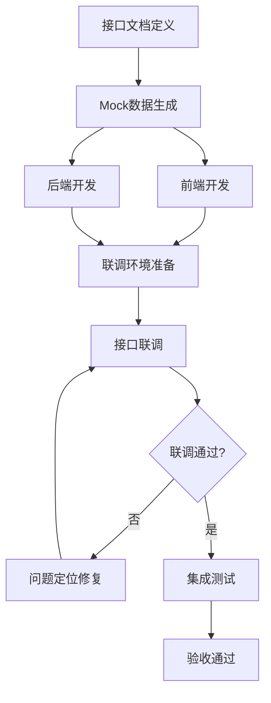

> ***YanYuCloudCube***
> **标语**：言启象限 | 语枢未来
> ***Words Initiate Quadrants, Language Serves as Core for the Future***
> **标语**：万象归元于云枢 | 深栈智启新纪元
> ***All things converge in the cloud pivot; Deep stacks ignite a new era of intelligence***

---

# 048 前后端联调接口适配文档

## 概述

本文档详细描述HaiLan Pro-HaiLan-Pro-详细设计-前后端联调接口适配文档相关内容，确保项目按照YYC³标准规范进行开发和实施。

## 核心内容

### 1. 背景与目标

#### 1.1 项目背景
HaiLan Pro (海蓝) 是新一代高端、私密、智能的情趣健康生活管理平台。项目基于「五高五标五化」理念，通过 PWA 技术结合 AI 智能辅助与物联网，为用户提供从生理健康到心理愉悦的全方位解决方案。

#### 1.2 项目愿景
打造极致隐私、智能陪伴、品质合规、全场景覆盖的情趣健康生活管理平台，为用户提供安全、专业、高端的健康生活体验。

#### 1.3 核心价值主张
- **极致隐私**：双重加密、隐私浏览模式及伪装发货机制
- **智能陪伴**：基于 LLM 的 AI 情感与生理健康顾问
- **品质合规**：医疗级标准商品，高端"海蓝蓝"视觉调性
- **全场景覆盖**：PWA 端支持离线浏览、桌面安装及无缝推送

#### 1.4 文档目标
- 规范前后端联调接口适配文档相关的业务标准与技术落地要求
- 为项目相关人员提供清晰的参考依据
- 保障相关模块开发、实施、运维的一致性与规范性

### 2. 设计原则

#### 2.1 五高原则
- **高可用性**：确保系统7x24小时稳定运行，支持PWA离线能力
- **高性能**：优化响应时间和处理能力，支持高并发访问
- **高安全性**：保护用户数据和隐私安全，双重加密机制
- **高扩展性**：支持业务快速扩展，微服务架构设计
- **高可维护性**：便于后续维护和升级，模块化设计

#### 2.2 五标体系
- **标准化**：统一的技术和流程标准
- **规范化**：严格的开发和管理规范
- **自动化**：提高开发效率和质量，CI/CD自动化
- **智能化**：利用AI技术提升能力，LLM智能顾问
- **可视化**：直观的监控和管理界面

#### 2.3 五化架构
- **流程化**：标准化的开发流程
- **文档化**：完善的文档体系
- **工具化**：高效的开发工具链
- **数字化**：数据驱动的决策
- **生态化**：开放的生态系统

### 3. 接口联调规范

#### 3.1 联调流程概览



#### 3.2 接口定义规范

##### 3.2.1 RESTful API 设计原则

```typescript
/**
 * API路径命名规范
 * - 使用小写字母和连字符
 * - 资源名使用复数形式
 * - 层级不超过3层
 */
const API_PATHS = {
  // 用户相关
  USERS: '/api/users',
  USER_PROFILE: '/api/users/:id/profile',

  // 商品相关
  PRODUCTS: '/api/products',
  PRODUCT_DETAIL: '/api/products/:id',
  PRODUCT_REVIEWS: '/api/products/:id/reviews',

  // 订单相关
  ORDERS: '/api/orders',
  ORDER_DETAIL: '/api/orders/:id',

  // AI相关
  AI_CHAT: '/api/ai/chat',
  AI_COMPANION: '/api/ai/companion'
} as const;
```

##### 3.2.2 统一响应格式

```typescript
/**
 * 统一API响应结构
 */
interface ApiResponse<T = any> {
  /** 响应码：0成功，非0失败 */
  code: number;
  /** 响应消息 */
  message: string;
  /** 响应数据 */
  data: T;
  /** 时间戳 */
  timestamp: number;
  /** 请求ID（用于问题追踪） */
  requestId: string;
}

/**
 * 分页响应数据结构
 */
interface PaginatedData<T> {
  /** 数据列表 */
  items: T[];
  /** 总数 */
  total: number;
  /** 当前页 */
  page: number;
  /** 每页数量 */
  pageSize: number;
  /** 总页数 */
  totalPages: number;
}

/**
 * 错误响应详情
 */
interface ErrorDetail {
  /** 错误码 */
  code: string;
  /** 错误消息 */
  message: string;
  /** 错误字段（用于表单验证） */
  field?: string;
  /** 详细信息 */
  details?: any;
}
```

#### 3.3 接口适配层设计

##### 3.3.1 前端HTTP客户端封装

```typescript
// src/shared/http/client.ts
import axios, { AxiosInstance, AxiosRequestConfig, AxiosError } from 'axios';
import { AuthService } from '@/services/auth';

/**
 * HTTP客户端配置
 */
interface HttpClientConfig {
  baseURL: string;
  timeout?: number;
  enableRetry?: boolean;
  maxRetries?: number;
}

/**
 * HTTP请求选项
 */
interface RequestOptions extends AxiosRequestConfig {
  /** 是否显示加载提示 */
  showLoading?: boolean;
  /** 是否显示错误提示 */
  showError?: boolean;
  /** 是否重试 */
  retry?: boolean;
}

/**
 * HTTP客户端类
 */
class HttpClient {
  private instance: AxiosInstance;
  private config: HttpClientConfig;

  constructor(config: HttpClientConfig) {
    this.config = {
      timeout: 30000,
      enableRetry: true,
      maxRetries: 3,
      ...config
    };

    this.instance = axios.create({
      baseURL: this.config.baseURL,
      timeout: this.config.timeout
    });

    this.setupInterceptors();
  }

  /**
   * 设置请求和响应拦截器
   */
  private setupInterceptors(): void {
    // 请求拦截器
    this.instance.interceptors.request.use(
      (config) => {
        // 添加认证token
        const token = AuthService.getToken();
        if (token) {
          config.headers['Authorization'] = `Bearer ${token}`;
        }

        // 添加请求ID
        config.headers['X-Request-ID'] = this.generateRequestId();

        // 添加设备信息
        config.headers['X-Device-Info'] = this.getDeviceInfo();

        return config;
      },
      (error) => {
        return Promise.reject(error);
      }
    );

    // 响应拦截器
    this.instance.interceptors.response.use(
      (response) => {
        const { data } = response;

        // 处理业务错误码
        if (data.code !== 0) {
          return Promise.reject({
            code: data.code,
            message: data.message,
            requestId: response.config.headers['X-Request-ID']
          });
        }

        return response.data;
      },
      async (error: AxiosError) => {
        const originalRequest = error.config as any;

        // 处理网络错误
        if (!error.response) {
          return Promise.reject({
            code: 'NETWORK_ERROR',
            message: '网络连接失败，请检查网络设置'
          });
        }

        const { status, data } = error.response;

        // 处理401未授权（token过期）
        if (status === 401 && !originalRequest._retry) {
          originalRequest._retry = true;
          try {
            const newToken = await AuthService.refreshToken();
            originalRequest.headers['Authorization'] = `Bearer ${newToken}`;
            return this.instance(originalRequest);
          } catch {
            AuthService.logout();
            window.location.href = '/login';
            return Promise.reject({
              code: 'AUTH_FAILED',
              message: '登录已过期，请重新登录'
            });
          }
        }

        // 处理403无权限
        if (status === 403) {
          return Promise.reject({
            code: 'PERMISSION_DENIED',
            message: '您没有权限执行此操作'
          });
        }

        // 处理404
        if (status === 404) {
          return Promise.reject({
            code: 'NOT_FOUND',
            message: '请求的资源不存在'
          });
        }

        // 处理500服务器错误
        if (status >= 500) {
          return Promise.reject({
            code: 'SERVER_ERROR',
            message: '服务器错误，请稍后重试'
          });
        }

        return Promise.reject(data || error);
      }
    );
  }

  /**
   * 生成请求ID
   */
  private generateRequestId(): string {
    return `${Date.now()}-${Math.random().toString(36).substring(2, 15)}`;
  }

  /**
   * 获取设备信息
   */
  private getDeviceInfo(): string {
    const ua = navigator.userAgent;
    return btoa(JSON.stringify({
      platform: navigator.platform,
      userAgent: ua.substring(0, 100)
    }));
  }

  /**
   * GET请求
   */
  async get<T = any>(url: string, params?: any, options?: RequestOptions): Promise<ApiResponse<T>> {
    return this.instance.get(url, { params, ...options });
  }

  /**
   * POST请求
   */
  async post<T = any>(url: string, data?: any, options?: RequestOptions): Promise<ApiResponse<T>> {
    return this.instance.post(url, data, options);
  }

  /**
   * PUT请求
   */
  async put<T = any>(url: string, data?: any, options?: RequestOptions): Promise<ApiResponse<T>> {
    return this.instance.put(url, data, options);
  }

  /**
   * DELETE请求
   */
  async delete<T = any>(url: string, params?: any, options?: RequestOptions): Promise<ApiResponse<T>> {
    return this.instance.delete(url, { params, ...options });
  }

  /**
   * 文件上传
   */
  async upload<T = any>(url: string, file: File, onProgress?: (progress: number) => void): Promise<ApiResponse<T>> {
    const formData = new FormData();
    formData.append('file', file);

    return this.instance.post(url, formData, {
      headers: {
        'Content-Type': 'multipart/form-data'
      },
      onUploadProgress: (progressEvent) => {
        if (onProgress && progressEvent.total) {
          const progress = Math.round((progressEvent.loaded * 100) / progressEvent.total);
          onProgress(progress);
        }
      }
    });
  }
}

// 创建全局HTTP客户端实例
export const http = new HttpClient({
  baseURL: import.meta.env.VITE_API_BASE_URL || '/api',
  timeout: 30000,
  enableRetry: true,
  maxRetries: 3
});
```

##### 3.3.2 API服务层封装

```typescript
// src/shared/api/user.ts
import { http } from '../http/client';
import { ApiResponse } from '../http/client';

/**
 * 用户信息接口
 */
interface UserInfo {
  id: string;
  nickname: string;
  avatar: string;
  email: string;
  phone: string;
  gender: 'male' | 'female' | 'other';
  birthDate: string;
  privacyMode: boolean;
}

/**
 * 用户注册参数
 */
interface RegisterParams {
  email: string;
  password: string;
  nickname: string;
  verificationCode: string;
}

/**
 * 用户登录参数
 */
interface LoginParams {
  account: string;
  password: string;
  captchaCode?: string;
}

/**
 * 用户登录响应
 */
interface LoginResponse {
  token: string;
  refreshToken: string;
  expiresIn: number;
  user: UserInfo;
}

/**
 * 用户API服务
 */
class UserApiService {
  private readonly base = '/api/users';

  /**
   * 用户注册
   */
  async register(params: RegisterParams): Promise<ApiResponse<LoginResponse>> {
    return http.post(`${this.base}/register`, params);
  }

  /**
   * 用户登录
   */
  async login(params: LoginParams): Promise<ApiResponse<LoginResponse>> {
    return http.post(`${this.base}/login`, params);
  }

  /**
   * 获取用户信息
   */
  async getProfile(): Promise<ApiResponse<UserInfo>> {
    return http.get(`${this.base}/profile`);
  }

  /**
   * 更新用户信息
   */
  async updateProfile(data: Partial<UserInfo>): Promise<ApiResponse<UserInfo>> {
    return http.put(`${this.base}/profile`, data);
  }

  /**
   * 退出登录
   */
  async logout(): Promise<ApiResponse<void>> {
    return http.post(`${this.base}/logout`);
  }
}

export const userApi = new UserApiService();
```

#### 3.4 Mock数据方案

##### 3.4.1 Mock服务配置

```typescript
// src/shared/mock/index.ts
import Mock from 'mockjs';

/**
 * Mock接口配置
 */
interface MockConfig {
  url: string;
  method: 'get' | 'post' | 'put' | 'delete';
  template: any;
}

/**
 * 用户Mock数据
 */
const userMocks: MockConfig[] = [
  {
    url: /\/api\/users\/login/,
    method: 'post',
    template: {
      code: 0,
      message: 'success',
      data: {
        token: '@string("lower", 32)',
        refreshToken: '@string("lower", 32)',
        expiresIn: 7200,
        user: {
          id: '@id',
          nickname: '@cname',
          avatar: '@image("100x100", "#0056b3", "FFF", "海蓝")',
          email: '@email',
          phone: /^1[3-9]\d{9}$/,
          gender: '@pick(["male", "female", "other"])',
          birthDate: '@date("yyyy-MM-dd")',
          privacyMode: false
        }
      },
      timestamp: '@now("T")'
    }
  },
  {
    url: /\/api\/users\/profile/,
    method: 'get',
    template: {
      code: 0,
      message: 'success',
      'data|1': [{
        id: '@id',
        nickname: '@cname',
        avatar: '@image("100x100", "#0056b3", "FFF", "海蓝")',
        email: '@email',
        phone: /^1[3-9]\d{9}$/,
        gender: '@pick(["male", "female", "other"])',
        birthDate: '@date("yyyy-MM-dd")',
        privacyMode: '@boolean'
      }],
      timestamp: '@now("T")'
    }
  }
];

/**
 * 商品Mock数据
 */
const productMocks: MockConfig[] = [
  {
    url: /\/api\/products/,
    method: 'get',
    template: {
      code: 0,
      message: 'success',
      data: {
        'items|10-20': [{
          id: '@id',
          name: '@ctitle(5,10)',
          description: '@cparagraph(1,3)',
          price: '@float(50, 500, 2, 2)',
          originalPrice: '@float(100, 800, 2, 2)',
          'images|3-5': ['@image("400x400", "#0056b3", "FFF", "海蓝")'],
          category: '@pick(["health", "care", "wellness", "accessories"])',
          stock: '@integer(0, 100)',
          sales: '@integer(0, 1000)',
          rating: '@float(3, 5, 1, 1)',
          reviews: '@integer(0, 500)'
        }],
        total: '@integer(50, 200)',
        page: 1,
        pageSize: 20,
        totalPages: '@integer(3, 10)'
      },
      timestamp: '@now("T")'
    }
  }
];

/**
 * 初始化Mock服务
 */
export function initMock(): void {
  if (import.meta.env.VITE_ENABLE_MOCK !== 'true') {
    return;
  }

  const allMocks = [...userMocks, ...productMocks];

  allMocks.forEach(config => {
    Mock.mock(
      new RegExp(config.url),
      config.method,
      (options: any) => {
        console.log(`[Mock] ${config.method.toUpperCase()} ${options.url}`);
        return Mock.mock(config.template);
      }
    );
  });

  console.log('[Mock] Mock服务已启动');
}
```

#### 3.5 接口联调流程

##### 3.5.1 联调检查清单

```typescript
// 联调前检查项
interface DebugChecklist {
  /** 接口文档是否完整 */
  apiDocumentComplete: boolean;
  /** Mock数据是否准备 */
  mockDataReady: boolean;
  /** 后端服务是否可访问 */
  backendAccessible: boolean;
  /** 数据库连接是否正常 */
  databaseConnected: boolean;
  /** 跨域配置是否正确 */
  corsConfigured: boolean;
  /** 认证token是否有效 */
  tokenValid: boolean;
}

/**
 * 联调环境检测
 */
class DebugEnvironment {
  /**
   * 检查后端服务状态
   */
  async checkBackendStatus(): Promise<boolean> {
    try {
      const response = await fetch(`${import.meta.env.VITE_API_BASE_URL}/health`);
      return response.ok;
    } catch {
      return false;
    }
  }

  /**
   * 检查数据库连接
   */
  async checkDatabaseConnection(): Promise<boolean> {
    try {
      const response = await http.get('/health/database');
      return response.code === 0;
    } catch {
      return false;
    }
  }

  /**
   * 验证Token有效性
   */
  async validateToken(): Promise<boolean> {
    const token = localStorage.getItem('access_token');
    if (!token) return false;

    try {
      const response = await http.get('/auth/validate');
      return response.code === 0;
    } catch {
      return false;
    }
  }

  /**
   * 运行所有检查
   */
  async runAllChecks(): Promise<DebugChecklist> {
    const results = await Promise.allSettled([
      this.checkBackendStatus(),
      this.checkDatabaseConnection(),
      this.validateToken()
    ]);

    return {
      apiDocumentComplete: true,
      mockDataReady: import.meta.env.VITE_ENABLE_MOCK === 'true',
      backendAccessible: results[0].status === 'fulfilled' ? results[0].value : false,
      databaseConnected: results[1].status === 'fulfilled' ? results[1].value : false,
      corsConfigured: true,
      tokenValid: results[2].status === 'fulfilled' ? results[2].value : false
    };
  }
}
```

##### 3.5.2 问题定位工具

```typescript
// src/shared/debug/tracer.ts
/**
 * API请求追踪器
 */
class ApiTracer {
  private traces: Map<string, any> = new Map();

  /**
   * 记录请求
   */
  traceRequest(requestId: string, config: any): void {
    this.traces.set(requestId, {
      startTime: Date.now(),
      url: config.url,
      method: config.method?.toUpperCase(),
      headers: config.headers,
      requestData: config.data,
      params: config.params
    });
  }

  /**
   * 记录响应
   */
  traceResponse(requestId: string, response: any): void {
    const trace = this.traces.get(requestId);
    if (trace) {
      trace.endTime = Date.now();
      trace.duration = trace.endTime - trace.startTime;
      trace.responseData = response;
      trace.success = true;
    }
  }

  /**
   * 记录错误
   */
  traceError(requestId: string, error: any): void {
    const trace = this.traces.get(requestId);
    if (trace) {
      trace.endTime = Date.now();
      trace.duration = trace.endTime - trace.startTime;
      trace.error = error;
      trace.success = false;
    }
  }

  /**
   * 获取追踪日志
   */
  getTraceLog(): string[] {
    return Array.from(this.traces.entries()).map(([id, trace]) => {
      return JSON.stringify({
        requestId: id,
        ...trace
      }, null, 2);
    });
  }

  /**
   * 导出追踪报告
   */
  exportReport(): string {
    const logs = this.getTraceLog();
    return logs.join('\n');
  }
}

// 全局追踪器实例
export const tracer = new ApiTracer();
```

#### 3.6 联调常见问题处理

##### 3.6.1 跨域问题解决方案

```typescript
// vite.config.ts - 开发环境代理配置
export default defineConfig({
  server: {
    proxy: {
      '/api': {
        target: 'http://localhost:3000',
        changeOrigin: true,
        rewrite: (path) => path
      }
    }
  }
});

// 后端CORS配置（NestJS）
// src/main.ts
app.enableCors({
  origin: [
    'http://localhost:5173',
    'https://hailan.example.com'
  ],
  credentials: true,
  methods: ['GET', 'POST', 'PUT', 'DELETE', 'OPTIONS'],
  allowedHeaders: ['Content-Type', 'Authorization', 'X-Request-ID', 'X-Device-Info']
});
```

##### 3.6.2 数据格式转换

```typescript
// src/shared/utils/adapter.ts
/**
 * 下划线转驼峰
 */
export function toCamelCase<T = any>(obj: any): T {
  if (obj === null || obj === undefined) return obj;

  if (Array.isArray(obj)) {
    return obj.map(item => toCamelCase(item)) as any;
  }

  if (typeof obj === 'object') {
    return Object.keys(obj).reduce((acc, key) => {
      const camelKey = key.replace(/_([a-z])/g, (_, letter) => letter.toUpperCase());
      acc[camelKey] = toCamelCase(obj[key]);
      return acc;
    }, {} as any);
  }

  return obj;
}

/**
 * 驼峰转下划线
 */
export function toSnakeCase<T = any>(obj: any): T {
  if (obj === null || obj === undefined) return obj;

  if (Array.isArray(obj)) {
    return obj.map(item => toSnakeCase(item)) as any;
  }

  if (typeof obj === 'object') {
    return Object.keys(obj).reduce((acc, key) => {
      const snakeKey = key.replace(/[A-Z]/g, letter => `_${letter.toLowerCase()}`);
      acc[snakeKey] = toSnakeCase(obj[key]);
      return acc;
    }, {} as any);
  }

  return obj;
}
```

### 4. 接口文档生成

#### 4.1 Swagger配置

```typescript
// src/main.ts - 后端Swagger配置
import { DocumentBuilder, SwaggerModule } from '@nestjs/swagger';

const config = new DocumentBuilder()
  .setTitle('HaiLan Pro API')
  .setDescription('高端私密智能情趣健康生活管理平台 API文档')
  .setVersion('1.0.0')
  .addBearerAuth()
  .addTag('users', '用户管理')
  .addTag('products', '商品管理')
  .addTag('orders', '订单管理')
  .addTag('ai', 'AI服务')
  .build();

const document = SwaggerModule.createDocument(app, config);
SwaggerModule.setup('api-docs', app, document);
```

#### 4.2 接口文档示例

```
# POST /api/users/login

用户登录接口

## 请求参数

| 字段 | 类型 | 必填 | 说明 |
|------|------|------|------|
| account | string | 是 | 账号（邮箱或手机号） |
| password | string | 是 | 密码（MD5加密） |
| captchaCode | string | 否 | 图形验证码 |

## 响应数据

```json
{
  "code": 0,
  "message": "登录成功",
  "data": {
    "token": "eyJhbGciOiJIUzI1NiIsInR5cCI6IkpXVCJ9...",
    "refreshToken": "eyJhbGciOiJIUzI1NiIsInR5cCI6IkpXVCJ9...",
    "expiresIn": 7200,
    "user": {
      "id": "user_123456",
      "nickname": "海蓝用户",
      "avatar": "https://cdn.hailan.com/avatar/123456.jpg"
    }
  },
  "timestamp": 1706659200000,
  "requestId": "20240131-abc123def456"
}
```
```

### 5. 附录

#### 5.1 HTTP状态码规范

| 状态码 | 说明 | 使用场景 |
|--------|------|----------|
| 200 | OK | 请求成功 |
| 201 | Created | 资源创建成功 |
| 204 | No Content | 删除成功 |
| 400 | Bad Request | 请求参数错误 |
| 401 | Unauthorized | 未认证或认证失败 |
| 403 | Forbidden | 无权限访问 |
| 404 | Not Found | 资源不存在 |
| 409 | Conflict | 资源冲突 |
| 422 | Unprocessable Entity | 业务逻辑校验失败 |
| 429 | Too Many Requests | 请求频率超限 |
| 500 | Internal Server Error | 服务器内部错误 |
| 502 | Bad Gateway | 网关错误 |
| 503 | Service Unavailable | 服务不可用 |

#### 5.2 业务错误码规范

| 错误码 | 说明 |
|--------|------|
| 0 | 成功 |
| 1001 | 参数校验失败 |
| 1002 | 数据已存在 |
| 1003 | 数据不存在 |
| 2001 | 未登录 |
| 2002 | Token过期 |
| 2003 | Token无效 |
| 3001 | 账户或密码错误 |
| 3002 | 账户已被禁用 |
| 3003 | 验证码错误 |
| 4001 | 商品库存不足 |
| 4002 | 订单已支付 |
| 5001 | 文件上传失败 |

---

> 「***YanYuCloudCube***」
> 「***<admin@0379.email>***」
> 「***Words Initiate Quadrants, Language Serves as Core for the Future***」
> 「***All things converge in the cloud pivot; Deep stacks ignite a new era of intelligence***」
