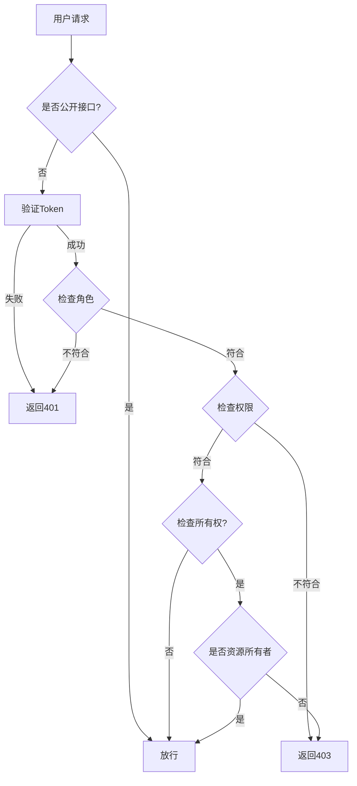

> ***YanYuCloudCube***
> **标语**：言启象限 | 语枢未来
> ***Words Initiate Quadrants, Language Serves as Core for the Future***
> **标语**：万象归元于云枢 | 深栈智启新纪元
> ***All things converge in the cloud pivot; Deep stacks ignite a new era of intelligence***

---

# 053 权限控制代码植入文档

## 概述

本文档详细描述HaiLan Pro-HaiLan-Pro-详细设计-权限控制代码植入文档相关内容，确保项目按照YYC³标准规范进行开发和实施。

## 核心内容

### 1. 背景与目标

#### 1.1 项目背景
HaiLan Pro (海蓝) 是新一代高端、私密、智能的情趣健康生活管理平台。项目基于「五高五标五化」理念，通过 PWA 技术结合 AI 智能辅助与物联网，为用户提供从生理健康到心理愉悦的全方位解决方案。

#### 1.2 项目愿景
打造极致隐私、智能陪伴、品质合规、全场景覆盖的情趣健康生活管理平台，为用户提供安全、专业、高端的健康生活体验。

#### 1.3 核心价值主张
- **极致隐私**：双重加密、隐私浏览模式及伪装发货机制
- **智能陪伴**：基于 LLM 的 AI 情感与生理健康顾问
- **品质合规**：医疗级标准商品，高端"海蓝蓝"视觉调性
- **全场景覆盖**：PWA 端支持离线浏览、桌面安装及无缝推送

#### 1.4 文档目标
- 规范权限控制代码植入文档相关的业务标准与技术落地要求
- 为项目相关人员提供清晰的参考依据
- 保障相关模块开发、实施、运维的一致性与规范性

### 2. 设计原则

#### 2.1 五高原则
- **高可用性**：确保系统7x24小时稳定运行，支持PWA离线能力
- **高性能**：优化响应时间和处理能力，支持高并发访问
- **高安全性**：保护用户数据和隐私安全，双重加密机制
- **高扩展性**：支持业务快速扩展，微服务架构设计
- **高可维护性**：便于后续维护和升级，模块化设计

#### 2.2 五标体系
- **标准化**：统一的技术和流程标准
- **规范化**：严格的开发和管理规范
- **自动化**：提高开发效率和质量，CI/CD自动化
- **智能化**：利用AI技术提升能力，LLM智能顾问
- **可视化**：直观的监控和管理界面

#### 2.3 五化架构
- **流程化**：标准化的开发流程
- **文档化**：完善的文档体系
- **工具化**：高效的开发工具链
- **数字化**：数据驱动的决策
- **生态化**：开放的生态系统

### 3. 权限控制代码植入

#### 3.1 权限模型设计

```typescript
// src/modules/permission/entities/role.entity.ts
import { Entity, PrimaryColumn, Column, ManyToMany, JoinTable } from 'typeorm';

/**
 * 用户角色枚举
 */
export enum UserRole {
  /** 普通用户 */
  USER = 'user',
  /** VIP用户 */
  VIP = 'vip',
  /** 管理员 */
  ADMIN = 'admin',
  /** 超级管理员 */
  SUPER_ADMIN = 'super_admin'
}

/**
 * 权限资源枚举
 */
export enum PermissionResource {
  /** 用户管理 */
  USER = 'user',
  /** 商品管理 */
  PRODUCT = 'product',
  /** 订单管理 */
  ORDER = 'order',
  /** 内容管理 */
  CONTENT = 'content',
  /** 数据统计 */
  ANALYTICS = 'analytics',
  /** 系统设置 */
  SYSTEM = 'system'
}

/**
 * 操作类型枚举
 */
export enum PermissionAction {
  /** 查看 */
  READ = 'read',
  /** 创建 */
  CREATE = 'create',
  /** 更新 */
  UPDATE = 'update',
  /** 删除 */
  DELETE = 'delete',
  /** 导出 */
  EXPORT = 'export'
}

/**
 * 角色实体
 */
@Entity('roles')
export class Role {
  @PrimaryColumn({ type: 'varchar', length: 32 })
  id: string;

  @Column({ type: 'varchar', length: 50, unique: true })
  name: string;

  @Column({ type: 'text', nullable: true })
  description: string;

  @Column({ type: 'simple-array' })
  permissions: string[];

  @Column({ type: 'timestamp', default: () => 'CURRENT_TIMESTAMP' })
  createdAt: Date;

  @Column({ type: 'timestamp', default: () => 'CURRENT_TIMESTAMP' })
  updatedAt: Date;
}

/**
 * 权限实体
 */
@Entity('permissions')
export class Permission {
  @PrimaryColumn({ type: 'varchar', length: 32 })
  id: string;

  @Column({ type: 'varchar', length: 50 })
  resource: PermissionResource;

  @Column({ type: 'varchar', length: 20 })
  action: PermissionAction;

  @Column({ type: 'varchar', length: 100, unique: true })
  code: string; // 格式: resource:action，如 user:read

  @Column({ type: 'varchar', length: 100 })
  name: string;

  @Column({ type: 'text', nullable: true })
  description: string;
}
```

#### 3.2 权限装饰器

##### 3.2.1 角色装饰器

```typescript
// src/shared/decorators/roles.decorator.ts
import { SetMetadata } from '@nestjs/common';
import { UserRole } from '@/modules/permission/entities/role.entity';

/**
 * 角色元数据键
 */
export const ROLES_KEY = 'roles';

/**
 * 设置所需角色装饰器
 * @usage @Roles(UserRole.ADMIN, UserRole.SUPER_ADMIN)
 */
export const Roles = (...roles: UserRole[]) => SetMetadata(ROLES_KEY, roles);

/**
 * 公开访问装饰器
 * 不需要认证即可访问
 * @usage @Public()
 */
export const Public = () => SetMetadata('isPublic', true);
```

##### 3.2.2 权限装饰器

```typescript
// src/shared/decorators/permissions.decorator.ts
import { SetMetadata } from '@nestjs/common';
import { PermissionResource, PermissionAction } from '@/modules/permission/entities/role.entity';

/**
 * 权限元数据键
 */
export const PERMISSIONS_KEY = 'permissions';

/**
 * 权限定义接口
 */
export interface PermissionDefinition {
  resource: PermissionResource;
  action: PermissionAction;
  /** 是否需要所有权（只能操作自己的资源） */
  requireOwnership?: boolean;
}

/**
 * 设置所需权限装饰器
 * @usage @Permissions({ resource: PermissionResource.USER, action: PermissionAction.READ })
 */
export const Permissions = (...definitions: PermissionDefinition[]) =>
  SetMetadata(PERMISSIONS_KEY, definitions);

/**
 * 需要资源所有权装饰器
 * 验证用户是否拥有资源所有权
 * @usage @RequireOwnership()
 */
export const RequireOwnership = () =>
  SetMetadata('requireOwnership', true);
```

#### 3.3 权限守卫

##### 3.3.1 角色守卫

```typescript
// src/modules/permission/guards/roles.guard.ts
import { Injectable, CanActivate, ExecutionContext } from '@nestjs/common';
import { Reflector } from '@nestjs/core';
import { UserRole } from '../entities/role.entity';
import { ROLES_KEY } from '@/shared/decorators/roles.decorator';

/**
 * 角色守卫
 * 验证用户是否具有所需角色
 */
@Injectable()
export class RolesGuard implements CanActivate {
  constructor(private readonly reflector: Reflector) {}

  canActivate(context: ExecutionContext): boolean {
    // 获取装饰器设置的角色要求
    const requiredRoles = this.reflector.getAllAndOverride<UserRole[]>(
      ROLES_KEY,
      [context.getHandler(), context.getClass()]
    );

    // 没有角色要求，放行
    if (!requiredRoles || requiredRoles.length === 0) {
      return true;
    }

    // 获取请求中的用户信息
    const request = context.switchToHttp().getRequest();
    const user = request.user;

    if (!user) {
      return false;
    }

    // 检查用户角色
    return requiredRoles.some(role => user.roles?.includes(role));
  }
}
```

##### 3.3.2 权限守卫

```typescript
// src/modules/permission/guards/permissions.guard.ts
import { Injectable, CanActivate, ExecutionContext } from '@nestjs/common';
import { Reflector } from '@nestjs/core';
import { PermissionDefinition, PERMISSIONS_KEY } from '@/shared/decorators/permissions.decorator';
import { PermissionService } from '../services/permission.service';

/**
 * 权限守卫
 * 验证用户是否具有所需权限
 */
@Injectable()
export class PermissionsGuard implements CanActivate {
  constructor(
    private readonly reflector: Reflector,
    private readonly permissionService: PermissionService
  ) {}

  async canActivate(context: ExecutionContext): Promise<boolean> {
    // 获取装饰器设置的权限要求
    const requiredPermissions = this.reflector.getAllAndOverride<PermissionDefinition[]>(
      PERMISSIONS_KEY,
      [context.getHandler(), context.getClass()]
    );

    // 没有权限要求，放行
    if (!requiredPermissions || requiredPermissions.length === 0) {
      return true;
    }

    // 获取请求中的用户信息
    const request = context.switchToHttp().getRequest();
    const user = request.user;

    if (!user) {
      return false;
    }

    // 超级管理员拥有所有权限
    if (user.roles?.includes(UserRole.SUPER_ADMIN)) {
      return true;
    }

    // 获取用户权限列表
    const userPermissions = await this.permissionService.getUserPermissions(user.id);

    // 检查是否具有所需权限
    for (const required of requiredPermissions) {
      const permissionCode = `${required.resource}:${required.action}`;

      if (!userPermissions.includes(permissionCode)) {
        return false;
      }

      // 如果需要所有权验证
      if (required.requireOwnership) {
        const resourceId = this.extractResourceId(request);
        const isOwner = await this.permissionService.checkResourceOwnership(
          user.id,
          required.resource,
          resourceId
        );

        if (!isOwner) {
          return false;
        }
      }
    }

    return true;
  }

  /**
   * 从请求中提取资源ID
   * @private
   */
  private extractResourceId(request: any): string {
    // 从路由参数或请求体中获取资源ID
    return request.params?.id || request.body?.id;
  }
}
```

##### 3.3.3 资源所有权守卫

```typescript
// src/modules/permission/guards/ownership.guard.ts
import { Injectable, CanActivate, ExecutionContext } from '@nestjs/common';
import { PermissionResource } from '../entities/role.entity';
import { PermissionService } from '../services/permission.service';

/**
 * 资源所有权守卫
 * 验证用户是否拥有指定资源的所有权
 */
@Injectable()
export class OwnershipGuard implements CanActivate {
  constructor(
    private readonly permissionService: PermissionService
  ) {}

  async canActivate(context: ExecutionContext): Promise<boolean> {
    const request = context.switchToHttp().getRequest();
    const user = request.user;

    if (!user) {
      return false;
    }

    // 资源类型和ID
    const resourceType = this.reflector.get<PermissionResource>(
      'resourceType',
      context.getHandler()
    );
    const resourceId = request.params?.id;

    if (!resourceType || !resourceId) {
      return false;
    }

    // 检查所有权
    return this.permissionService.checkResourceOwnership(
      user.id,
      resourceType,
      resourceId
    );
  }
}
```

#### 3.4 权限服务

```typescript
// src/modules/permission/services/permission.service.ts
import { Injectable } from '@nestjs/common';
import { InjectRepository } from '@nestjs/typeorm';
import { Repository } from 'typeorm';
import { Role, Permission } from '../entities/role.entity';
import { UserService } from '@/modules/user/services/user.service';

/**
 * 权限服务
 * 管理角色、权限的分配和验证
 */
@Injectable()
export class PermissionService {
  constructor(
    @InjectRepository(Role)
    private readonly roleRepository: Repository<Role>,
    @InjectRepository(Permission)
    private readonly permissionRepository: Repository<Permission>,
    private readonly userService: UserService
  ) {}

  /**
   * 获取用户权限列表
   * @param userId 用户ID
   * @returns 权限代码列表
   */
  async getUserPermissions(userId: string): Promise<string[]> {
    // 获取用户角色
    const user = await this.userService.findById(userId);
    if (!user) return [];

    // 获取角色的权限
    const roles = await this.roleRepository
      .createQueryBuilder('role')
      .where('role.id IN (:...roleIds)', { roleIds: user.roleIds || [] })
      .getMany();

    // 合并所有权限
    const permissions = new Set<string>();
    for (const role of roles) {
      role.permissions.forEach(p => permissions.add(p));
    }

    return Array.from(permissions);
  }

  /**
   * 检查用户是否有指定权限
   * @param userId 用户ID
   * @param resource 资源类型
   * @param action 操作类型
   */
  async hasPermission(
    userId: string,
    resource: string,
    action: string
  ): Promise<boolean> {
    const permissions = await this.getUserPermissions(userId);
    const permissionCode = `${resource}:${action}`;
    return permissions.includes(permissionCode);
  }

  /**
   * 检查资源所有权
   * @param userId 用户ID
   * @param resource 资源类型
   * @param resourceId 资源ID
   */
  async checkResourceOwnership(
    userId: string,
    resource: string,
    resourceId: string
  ): Promise<boolean> {
    switch (resource) {
      case PermissionResource.USER:
        // 用户资源：只能操作自己
        return resourceId === userId;

      case PermissionResource.ORDER:
        // 订单资源：检查订单是否属于用户
        return this.checkOrderOwnership(userId, resourceId);

      case PermissionResource.CONTENT:
        // 内容资源：检查内容是否由用户创建
        return this.checkContentOwnership(userId, resourceId);

      default:
        return false;
    }
  }

  /**
   * 检查订单所有权
   * @private
   */
  private async checkOrderOwnership(userId: string, orderId: string): Promise<boolean> {
    const order = await this.orderRepository.findOne({
      where: { id: orderId }
    });
    return order?.userId === userId;
  }

  /**
   * 检查内容所有权
   * @private
   */
  private async checkContentOwnership(userId: string, contentId: string): Promise<boolean> {
    const content = await this.contentRepository.findOne({
      where: { id: contentId }
    });
    return content?.authorId === userId;
  }

  /**
   * 分配角色给用户
   * @param userId 用户ID
   * @param roleIds 角色ID列表
   */
  async assignRolesToUser(userId: string, roleIds: string[]): Promise<void> {
    await this.userService.update(userId, { roleIds });
  }

  /**
   * 创建角色
   * @param name 角色名称
   * @param description 描述
   * @param permissions 权限列表
   */
  async createRole(
    name: string,
    description: string,
    permissions: string[]
  ): Promise<Role> {
    const role = this.roleRepository.create({
      id: this.generateRoleId(),
      name,
      description,
      permissions
    });

    return this.roleRepository.save(role);
  }

  /**
   * 更新角色权限
   * @param roleId 角色ID
   * @param permissions 权限列表
   */
  async updateRolePermissions(
    roleId: string,
    permissions: string[]
  ): Promise<void> {
    await this.roleRepository.update(roleId, { permissions });
  }

  /**
   * 生成角色ID
   * @private
   */
  private generateRoleId(): string {
    return `role_${Date.now()}_${Math.random().toString(36).substring(2, 8)}`;
  }
}
```

#### 3.5 前端权限控制

##### 3.5.1 权限指令

```typescript
// src/shared/directives/permission.directive.ts
import { Directive, Input, TemplateRef, ViewContainerRef, OnInit } from 'vue';
import { useUserStore } from '@/stores/user';

/**
 * 权限指令
 * @usage v-permission="{ resource: 'user', action: 'read' }"
 */
@Directive({
  selector: '[vPermission]'
})
export class PermissionDirective implements OnInit {
  @Input() set vPermission(value: { resource: string; action: string }) {
    this.permission = value;
  }

  private permission: { resource: string; action: string } | null = null;
  private userStore = useUserStore();

  constructor(
    private templateRef: TemplateRef<any>,
    private viewContainer: ViewContainerRef
  ) {}

  ngOnInit(): void {
    if (this.checkPermission()) {
      this.viewContainer.createEmbeddedView(this.templateRef);
    } else {
      this.viewContainer.clear();
    }
  }

  /**
   * 检查权限
   */
  private checkPermission(): boolean {
    if (!this.permission) return true;

    const { resource, action } = this.permission;
    return this.userStore.hasPermission(`${resource}:${action}`);
  }
}

/**
 * 角色指令
 * @usage v-role="'admin'"
 */
@Directive({
  selector: '[vRole]'
})
export class RoleDirective implements OnInit {
  @Input() set vRole(value: string | string[]) {
    this.requiredRoles = Array.isArray(value) ? value : [value];
  }

  private requiredRoles: string[] = [];
  private userStore = useUserStore();

  constructor(
    private templateRef: TemplateRef<any>,
    private viewContainer: ViewContainerRef
  ) {}

  ngOnInit(): void {
    if (this.checkRole()) {
      this.viewContainer.createEmbeddedView(this.templateRef);
    } else {
      this.viewContainer.clear();
    }
  }

  /**
   * 检查角色
   */
  private checkRole(): boolean {
    if (this.requiredRoles.length === 0) return true;

    return this.requiredRoles.some(role =>
      this.userStore.roles?.includes(role)
    );
  }
}
```

##### 3.5.2 权限Store

```typescript
// src/stores/user.ts
import { defineStore } from 'pinia';
import { ref, computed } from 'vue';

export const useUserStore = defineStore('user', () => {
  const user = ref<any>(null);
  const permissions = ref<string[]>([]);
  const roles = ref<string[]>([]);

  /**
   * 是否有指定权限
   */
  const hasPermission = (permissionCode: string): boolean => {
    // 超级管理员拥有所有权限
    if (roles.value.includes('super_admin')) {
      return true;
    }

    return permissions.value.includes(permissionCode);
  };

  /**
   * 是否有指定角色
   */
  const hasRole = (role: string): boolean => {
    return roles.value.includes(role);
  };

  /**
   * 是否是管理员
   */
  const isAdmin = computed(() => {
    return roles.value.includes('admin') || roles.value.includes('super_admin');
  });

  /**
   * 是否是VIP用户
   */
  const isVip = computed(() => {
    return roles.value.includes('vip');
  });

  /**
   * 设置用户信息
   */
  const setUser = (userData: any) => {
    user.value = userData;
    permissions.value = userData.permissions || [];
    roles.value = userData.roles || [];
  };

  /**
   * 清除用户信息
   */
  const clearUser = () => {
    user.value = null;
    permissions.value = [];
    roles.value = [];
  };

  return {
    user,
    permissions,
    roles,
    hasPermission,
    hasRole,
    isAdmin,
    isVip,
    setUser,
    clearUser
  };
});
```

#### 3.6 权限配置示例

```typescript
// src/config/permissions.ts
import { PermissionResource, PermissionAction } from '@/modules/permission/entities/role.entity';

/**
 * 默认角色权限配置
 */
export const DEFAULT_ROLE_PERMISSIONS = {
  // 普通用户权限
  user: [
    'user:read',      // 查看自己信息
    'user:update',    // 更新自己信息
    'product:read',   // 查看商品
    'order:create',   // 创建订单
    'order:read',     // 查看自己订单
    'order:cancel',   // 取消自己订单
    'content:read'    // 查看内容
  ],

  // VIP用户权限
  vip: [
    // 继承普通用户所有权限
    ...DEFAULT_ROLE_PERMISSIONS.user,
    'order:export',   // 导出订单
    'content:create'  // 发布内容
  ],

  // 管理员权限
  admin: [
    'user:read',
    'user:update',
    'product:read',
    'product:create',
    'product:update',
    'product:delete',
    'order:read',
    'order:update',
    'content:read',
    'content:update',
    'content:delete',
    'analytics:read'  // 查看统计数据
  ],

  // 超级管理员权限（所有权限）
  super_admin: ['*']
};

/**
 * 初始化权限数据
 */
export async function initializePermissions() {
  // 创建所有权限定义
  const allPermissions: Array<{ resource: string; action: string; code: string; name: string }> = [];

  for (const resource of Object.values(PermissionResource)) {
    for (const action of Object.values(PermissionAction)) {
      const code = `${resource}:${action}`;
      const name = `${resource}_${action}`; // user_read, user_create等

      allPermissions.push({
        resource,
        action,
        code,
        name
      });
    }
  }

  return allPermissions;
}
```

### 4. 附录

#### 4.1 权限检查流程



#### 4.2 常见权限配置

| 资源 | 操作 | 权限码 | 普通用户 | VIP | 管理员 |
|------|------|--------|----------|-----|--------|
| 用户 | 查看 | user:read | 仅自己 | 仅自己 | 全部 |
| 用户 | 更新 | user:update | 仅自己 | 仅自己 | 全部 |
| 商品 | 查看 | product:read | ✓ | ✓ | ✓ |
| 商品 | 创建 | product:create | ✗ | ✗ | ✓ |
| 商品 | 更新 | product:update | ✗ | ✗ | ✓ |
| 商品 | 删除 | product:delete | ✗ | ✗ | ✓ |
| 订单 | 创建 | order:create | ✓ | ✓ | ✓ |
| 订单 | 查看 | order:read | 仅自己 | 仅自己 | 全部 |
| 订单 | 取消 | order:cancel | 仅自己 | 仅自己 | 全部 |

---

> 「***YanYuCloudCube***」
> 「***<admin@0379.email>***」
> 「***Words Initiate Quadrants, Language Serves as Core for the Future***」
> 「***All things converge in the cloud pivot; Deep stacks ignite a new era of intelligence***」
